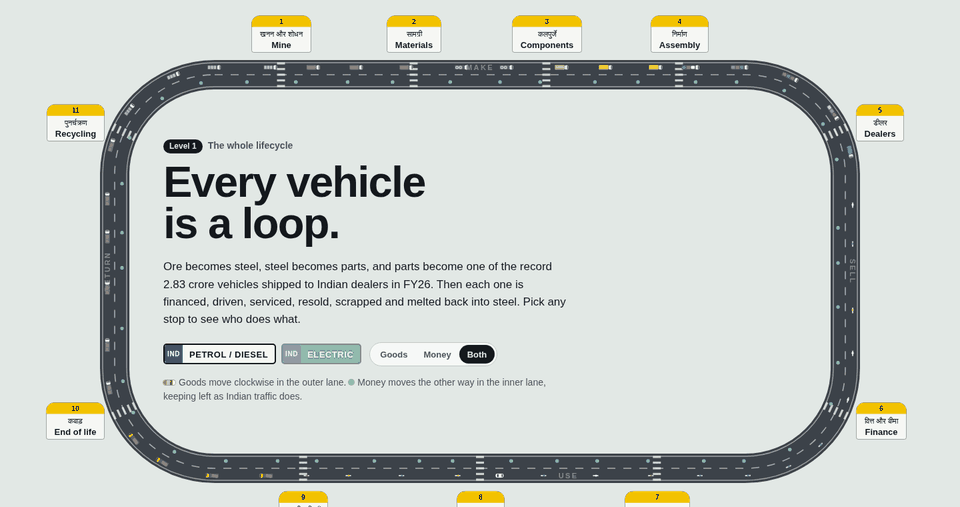
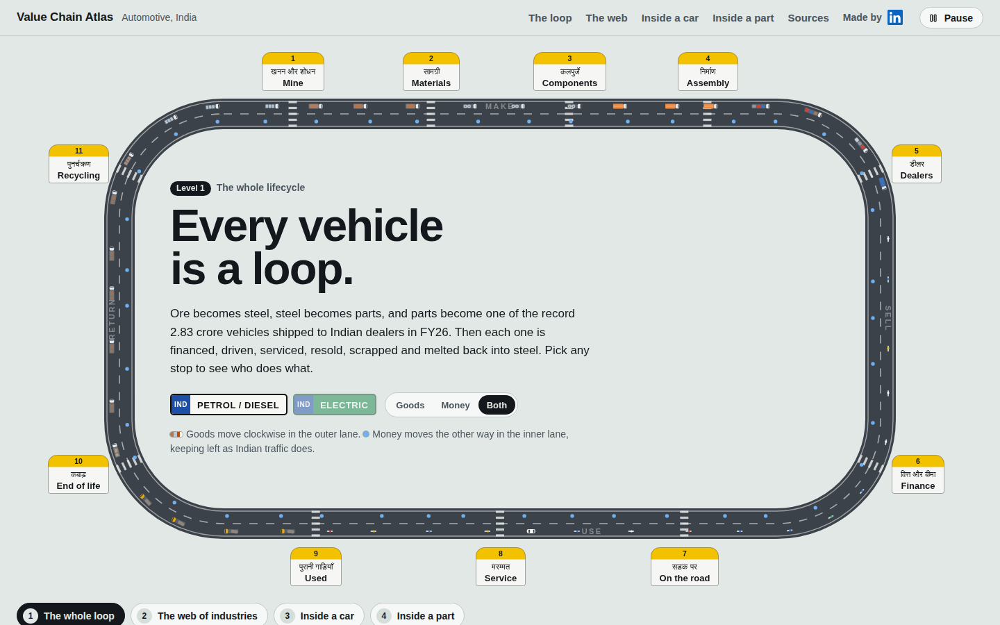
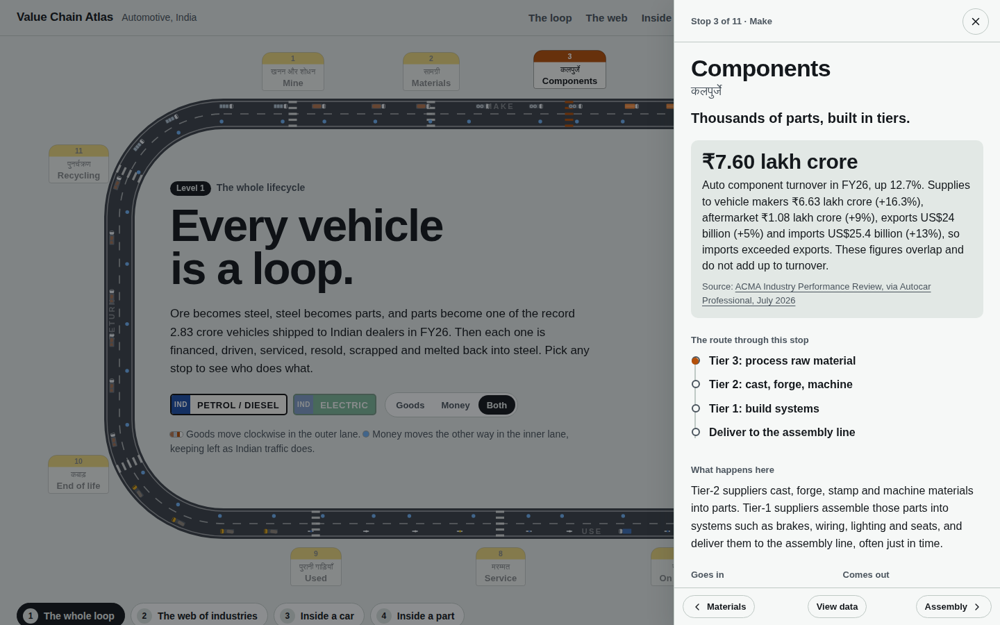
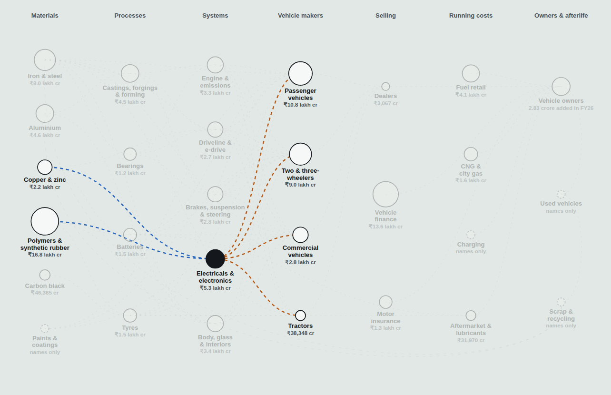
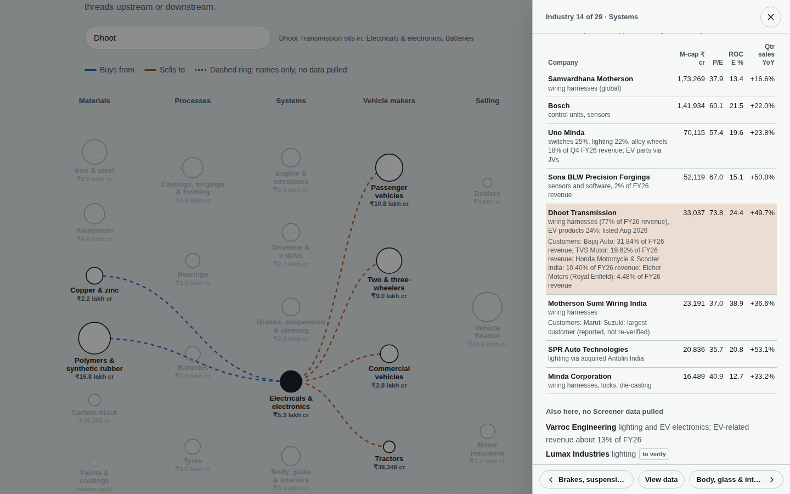
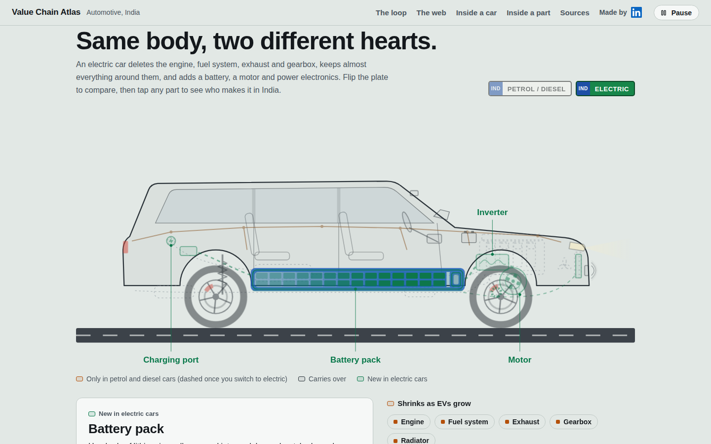
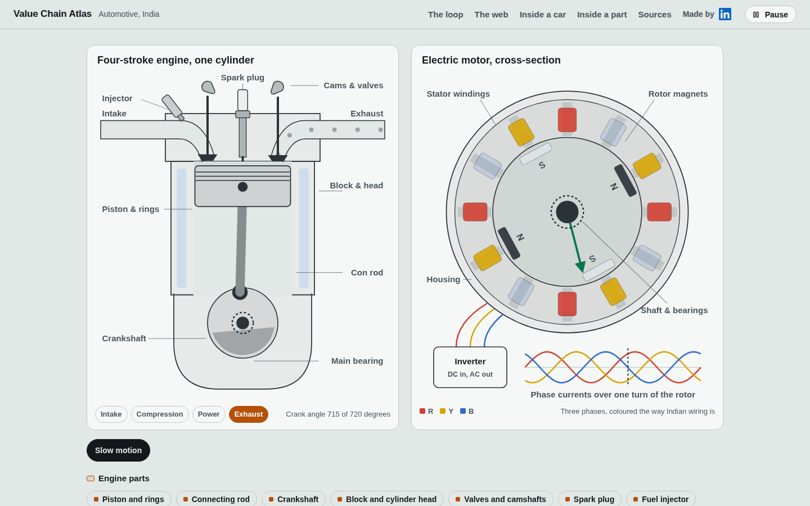
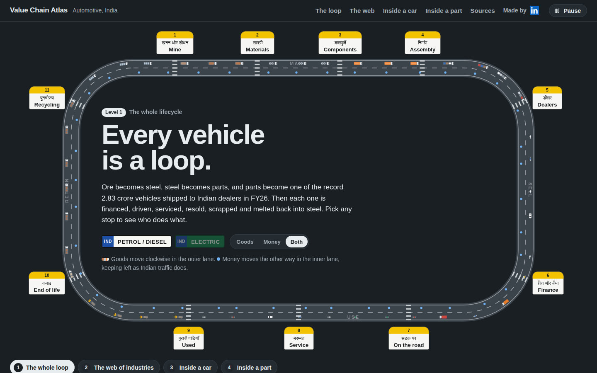
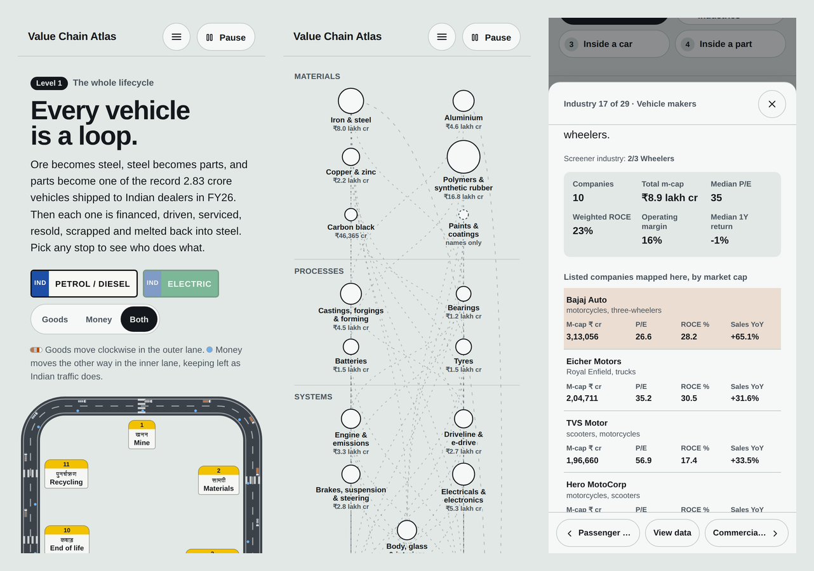
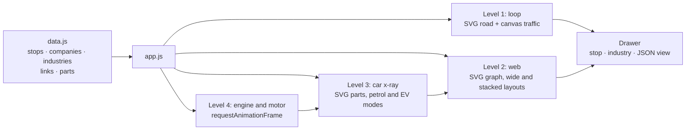

<div align="center">

# Value Chain Atlas · Automotive, India

**Every vehicle is a loop. This site maps all of it, from iron ore to a single piston.**

An animated, four-level atlas of India's automotive value chain: the full lifecycle loop, a web of 29 industries and 95 listed companies, an x-ray of a petrol car and an electric car, and working cross-sections of an engine and a traction motor.

[](https://kaustubhbarve.github.io/Value-Chain-Autos/)


[Live demo](https://kaustubhbarve.github.io/Value-Chain-Autos/) ·
[The four levels](#the-four-levels) ·
[Quick start](#quick-start) ·
[Data model](#data-model) ·
[Methodology](#methodology-and-sources) ·
[Author](#author)

<br>



</div>

---

## Table of contents

- [What is a value chain](#what-is-a-value-chain)
- [Why this project exists](#why-this-project-exists)
- [At a glance](#at-a-glance)
- [The four levels](#the-four-levels)
- [Screenshots](#screenshots)
- [Features](#features)
- [How it works](#how-it-works)
- [Project structure](#project-structure)
- [Quick start](#quick-start)
- [Data model](#data-model)
- [Common tasks](#common-tasks)
- [Methodology and sources](#methodology-and-sources)
- [Known limitations](#known-limitations)
- [Contributing](#contributing)
- [Disclaimer](#disclaimer)
- [License](#license)
- [Acknowledgements](#acknowledgements)
- [Author](#author)

---

## What is a value chain

A **value chain** is the sequence of businesses that turn raw inputs into a finished product and then keep earning from it through its life. Each link buys from the one before it and sells to the one after it, and each captures a share of the final value.

In autos, that chain is unusually long and it loops back on itself:

- **Upstream:** a mine sells iron ore to a steel mill, which sells coil to a forging shop, which sells a crankshaft to an engine maker.
- **Midstream:** Tier-2 suppliers make parts, Tier-1 suppliers assemble them into systems, and the vehicle maker assembles the car.
- **Downstream:** a dealer sells it, a lender finances it, an insurer covers it, a fuel retailer or charge-point operator powers it, and a workshop services it.
- **Return:** the car is resold, scrapped, and its steel and aluminium are melted back into the start of the loop.

Understanding where a listed company sits in that chain explains most of what drives its numbers: whose volumes it depends on, whose prices it absorbs, and what happens to it as electric vehicles replace engines.

## Why this project exists

Industry pages on stock screeners list companies in flat tables. They do not show **who sells to whom**, **which parts disappear in an electric car**, or **where the money flows after the vehicle leaves the factory**.

This atlas turns that into something you can see and click:

- **For investors and analysts:** a map of the chain with live-style company data at every node, so you can go from "EV adoption" to "which listed suppliers gain or lose content" in three clicks.
- **For students:** a visual explanation of how the auto economy works, from ore to scrap, with real FY26 figures.
- **For builders:** a sector-agnostic data model. Mapping another industry means writing a new `data.js`, not building a new site.

## At a glance

| Item | Count |
|---|---|
| Lifecycle stops in the loop | 11 |
| Industries in the web | 29 |
| Buyer and seller links between industries | 68 |
| Listed companies with Screener data | 95 |
| Named supplier to customer links | 18 |
| Car parts in the x-ray (petrol and electric) | 18 |
| Engine and motor sub-parts | 14 |
| Cited sources | 36 |
| Runtime dependencies | 0 |

Selected figures shown on the site (FY26 unless stated):

- **2.83 crore** vehicles dispatched to Indian dealers, a record (SIAM).
- **₹7.60 lakh crore** auto component industry turnover, up 12.7% (ACMA).
- **4.6%** of domestic OEM component supplies were EV parts, excluding lithium-ion cells (ACMA).
- **47.48% petrol, 21.98% CNG, 18.08% diesel, 8.21% hybrid, 4.25% electric** share of new passenger vehicles by fuel.
- **80%+** of India's rare-earth magnet imports in FY24 came from China, which has required export licences since April 2025.

## The four levels

The site zooms in four steps. Every level links to the others, so any stop, industry, car part or engine part is at most a click away from the rest.

### Level 1 · The whole loop



- An animated road with **11 milestone stops**: Mine, Materials, Components, Assembly, Dealers, Finance, On the road, Service, Used, End of life, Recycling.
- **Goods move clockwise** in the outer lane as vehicles that match each stage: ore tippers, coil trucks, parts trucks, car carriers, owner traffic in the FY26 mix of two-wheelers, cars, trucks and autos, tow trucks and scrap trucks.
- **Money moves anticlockwise** in the inner lane.
- A **petrol/electric switch** redraws the chain for an EV world, and a **Goods / Money / Both** control isolates either flow.
- Each stop opens a drawer with what happens there, inputs and outputs, the main listed players, what drives the economics, how EVs change it, and a sourced key statistic.



### Level 2 · The web of industries



- **29 industries in 7 stages:** Materials, Processes, Systems, Vehicle makers, Selling, Running costs, Owners and afterlife.
- **Circle size** reflects the listed market cap mapped to each industry.
- **Hover or focus** an industry to light up what it buys (blue) and what it sells to (orange).
- **Open** an industry for its Screener snapshot (companies, total market cap, median P/E, weighted ROCE, operating margin, median one-year return) and a table of mapped companies with market cap, P/E, ROCE and latest-quarter sales growth, each linked to Screener.
- **Company search** with autocomplete jumps straight to the right industry and highlights the row. Former names also work, for example "Shriram Pistons", "Tide Water" or "SML Isuzu".
- **Named customer links**: where a prospectus or filing names customers, the supplier's row lists them, and each vehicle maker lists its named suppliers, tagged *disclosed* or *reported*.



### Level 3 · Inside a car



- An x-ray of a compact SUV with **18 clickable parts**, switchable between **petrol/diesel** and **electric** using number-plate toggles.
- Parts are grouped as **shrinks as EVs grow** (engine, fuel system, exhaust, gearbox, radiator), **carries over** (tyres, brakes, suspension, body, lighting, wiring, electronics, 12V battery) and **grows with EVs** (battery pack, motor, inverter, charging, thermal management).
- Each part shows who makes it in India with market cap, and why it matters. It also links to its industry in Level 2, and to Level 4 for engine and motor parts.
- A **FY26 fuel-mix bar** shows what India's new cars actually ran on.

### Level 4 · Inside a part



- A **four-stroke engine** with real crank geometry: piston, connecting rod, crankshaft, cams, valve timing, spark, fuel spray, and gas colour by stroke. The stroke indicator changes at the correct crank angle.
- A **permanent-magnet synchronous motor** with 12 stator teeth, R/Y/B phase colouring (the Indian wiring convention), a rotating magnetic field, rotor magnets and a live phase-current trace.
- A **slow-motion** toggle, and **14 sub-parts** you can pick by tapping the drawing or the chip list, each with what it is, who makes it and why it matters.

## Screenshots

<table>
  <tr>
    <td width="50%"><br><sub><b>Dark mode</b> follows the system setting.</sub></td>
    <td width="50%"><br><sub><b>Supply links</b> light up on hover or focus.</sub></td>
  </tr>
</table>


<sub><b>Phones:</b> the header collapses into a menu, the industry web stacks vertically with no sideways scrolling, and company tables become labelled cards.</sub>

## Features

**Exploration**
- Four linked zoom levels with cross-navigation: stop → industry → car part → engine or motor part, and back.
- Drawer with previous/next navigation through all stops or all 29 industries.
- **View data** switch in every drawer that shows the underlying JSON for that stop or industry.
- Company search with aliases for renamed companies.

**Data**
- 95 companies with market cap, P/E, ROCE and quarterly sales growth from Screener, fetched 25 September 2026.
- 21 Screener industry snapshots.
- Product lines and customer links checked against prospectuses, results presentations and exchange filings on 25 September 2026, with a visible **to verify** tag on anything unconfirmed.
- A verification log and 36 linked sources in the footer.

**Experience**
- Light and dark themes from the system setting.
- Fully responsive from 320px phones to 2560px monitors, with no horizontal scrolling at any width.
- Keyboard accessible, with visible focus and screen reader labels.
- Animations pause when off screen or when the tab is hidden, and respect *reduced motion*.

## How it works

The site is plain HTML, CSS and JavaScript. Content lives in one data file and a single script renders every level from it.



| Layer | Technique | Notes |
|---|---|---|
| Loop road | SVG built from a `Track` geometry class | Re-laid out with `ResizeObserver`; a tall layout is used on narrow screens |
| Traffic | `<canvas>` with per-stage vehicle sprites | Paused by `IntersectionObserver` and `visibilitychange` |
| Industry web | SVG generated from `NODES` and `EDGES` | Seven columns from 960px up, stacked stages below that, switched live on resize |
| Car x-ray | Inline SVG with `data-part` hotspots | Petrol parts fade to dashed outlines in EV mode |
| Engine | Crank-slider kinematics in `requestAnimationFrame` | Piston position from crank angle and rod length; valve lift from cam phase |
| Motor | Rotating field vector and three phase currents 120° apart | Stator tooth brightness follows phase current |
| Drawer | Accessible dialog | Focus trap, Escape to close, focus returned to the opener |

## Project structure

```
Value-Chain-Autos/
├── index.html               Page markup and inline SVG drawings; no inline scripts
├── 404.html                 Not-found page used by GitHub Pages
├── robots.txt
├── .nojekyll                Tells GitHub Pages to serve files as they are
├── README.md
├── docs/
│   └── screenshots/         Images used in this README
└── assets/
    ├── css/styles.css       All styles, light and dark themes, responsive rules
    ├── js/data.js           All content: stops, companies, industries, links, parts
    ├── js/app.js            All behaviour; needs data.js loaded first
    └── img/favicon.svg
```

| File | Size | Role |
|---|---|---|
| `assets/js/data.js` | ~65 KB | Single source of truth for everything shown |
| `assets/js/app.js` | ~54 KB | Rendering and interaction for all four levels |
| `assets/css/styles.css` | ~39 KB | Design tokens, layout, themes, breakpoints |
| `index.html` | ~45 KB | Structure plus the car, engine and motor drawings |

## Quick start

No install, no build.

```bash
git clone https://github.com/KaustubhBarve/Value-Chain-Autos.git
cd Value-Chain-Autos
python3 -m http.server 8000
```

Open <http://localhost:8000>.

Opening `index.html` directly also works. Serving over HTTP is better because the Content Security Policy then behaves as it will online. Any static server works, for example `npx serve .`.

## Data model

Everything on the page comes from `assets/js/data.js`. The constants are listed below in load order.

| Constant | Purpose |
|---|---|
| `ASOF` | Date the Screener data was fetched |
| `SCR` | Screener base URL; company paths are appended to it |
| `DATA` | `stations` (11 loop stops) and `parts` (18 car parts) |
| `CO_RAW` | 95 companies keyed by id |
| `IND` | 21 Screener industry snapshots |
| `COLS` | The 7 stage names of the web |
| `NODES` | The 29 industries |
| `EDGES` | The 68 seller to buyer links |
| `LINKS` | The 18 supplier to customer links |
| `VERIFIED` | Date the product lines and links were checked |
| `PW` | The 14 engine and motor sub-parts |

<details>
<summary><b>CO_RAW: companies</b></summary>

```js
dhoot: ["Dhoot Transmission", "DHOOTTRANS/consolidated/", 33036.69, 73.76, 1446.42, 49.68, 24.36,
        "Auto Components & Equipments", "wiring harnesses (77% of FY26 revenue), EV products 24%; listed Aug 2026"],
```

| Index | Field | Unit |
|---|---|---|
| 0 | Name | |
| 1 | Screener path (appended to `SCR`) | |
| 2 | Market cap | ₹ crore |
| 3 | P/E | x |
| 4 | Latest-quarter sales | ₹ crore |
| 5 | Quarterly sales growth YoY | % |
| 6 | ROCE | % |
| 7 | Screener industry | |
| 8 | Role shown on the page | |
| 9 | Optional `1` = show a "to verify" tag | |

Use `null` for a missing figure; the page shows a dash.
</details>

<details>
<summary><b>IND: Screener industry snapshots</b></summary>

```js
"Passenger Cars & Utility Vehicles": [8, 1052855, 66077, 45, 9, 11, 19, -24],
```

| Index | Field |
|---|---|
| 0 | Number of companies |
| 1 | Total market cap, ₹ crore |
| 2 | Median market cap, ₹ crore |
| 3 | Median P/E |
| 4 | Sales growth, % |
| 5 | Operating margin, % |
| 6 | Weighted ROCE, % |
| 7 | Median one-year return, % |
</details>

<details>
<summary><b>NODES: industries in the web</b></summary>

```js
{ id: "batt", col: 1, name: "Batteries", lab: ["Batteries"], ind: [],
  what: "Lead-acid starter batteries today; lithium-ion cells and packs for EVs...",
  cos: ["exide", "amararaja", { id: "dhoot", note: "battery packs" }],
  extra: [["Agratas", "Tata group cell maker", 1]] }
```

| Field | Meaning |
|---|---|
| `id` | Unique key used by edges, parts and drawers |
| `col` | Stage index into `COLS` (0 = Materials … 6 = Owners and afterlife) |
| `name`, `lab` | Full name and the label lines drawn under the circle |
| `ind` | Screener industries whose snapshot is shown |
| `what` | One-paragraph description |
| `cos` | Company ids. A plain id is the company's **primary** industry. `{id, note}` is a secondary mapping with its own role text, and `v: 1` adds a "to verify" tag |
| `extra` | Names without Screener data: `[name, note, unlisted?, toVerify?]` |
| `parts` | Car part ids from Level 3 that belong here (optional) |
| `sub` | Label used when there is no market cap, for example "2.83 crore added in FY26" (optional) |
| `also` | Makers that also sell heavily here, shown as chips (optional) |
</details>

<details>
<summary><b>EDGES and LINKS: supply relationships</b></summary>

```js
// EDGES: industry level, [seller, buyer]
["steel", "forge"], ["forge", "ptrain"], ["ptrain", "pv"]

// LINKS: company level, [supplier, customer, detail, basis, brand?]
["dhoot", "bajaj", "31.84% of FY26 revenue", "d"],
["belrise", "tmpv", "named in the prospectus", "d", "Jaguar Land Rover"],
["mswil", "maruti", "largest customer", "r"]
```

- Edges run **seller → buyer**. On hover, a node's incoming edges turn blue (buys from) and outgoing edges orange (sells to). Edges that run backwards in the chain, such as recycling to steel, curve around the outside.
- In `LINKS`, supplier and customer are company ids when the company is in the web, otherwise display names. `basis` is `d` for disclosed in an IPO document or company filing, `r` for reported in the media only. The optional fifth item is the brand shown in brackets.
</details>

<details>
<summary><b>DATA.stations: loop stops</b></summary>

| Field | Meaning |
|---|---|
| `id`, `short`, `name` | Key, sign label, drawer title |
| `hi`, `hiS` | Hindi name and short Hindi sign label |
| `phase` | Make, Sell, Use or Return |
| `node` | Industry opened by "Open the industry" |
| `tag`, `what`, `cash`, `ev` | Headline, description, how money moves, how EVs change it |
| `flow`, `inputs`, `outputs`, `drivers` | Lists shown in the drawer |
| `anchor`, `players` | Largest player and other named players |
| `stat`, `evx` | Key statistic `{v, l, src, url}` for petrol and electric modes |
</details>

<details>
<summary><b>DATA.parts and PW: car parts and engine or motor parts</b></summary>

```js
{ id: "battery", name: "Battery pack", mode: "ev", node: "batt",
  what: "...", co: [{ id: "exide", note: "6 GWh Phase I cell plant..." }, ["Agratas", "Tata group cell maker", 1]],
  why: "..." }
```

| Field | Meaning |
|---|---|
| `mode` | `ice` (only in petrol and diesel cars), `both` (carries over) or `ev` (new in electric cars) |
| `node` | Industry in Level 2 |
| `pw` | Level 4 sub-part opened by "See how it works inside" (optional) |
| `co` | Company ids, `{id, note, v}`, or `[name, note, unlisted?, toVerify?]` |
| `PW[id].kind` | "Engine part" or "Motor part" |
| `PW[id].car` | Level 3 part opened by "Find it in the car" |
</details>

## Common tasks

**Refresh market data**

1. Open each company's Screener page, which is `SCR` plus the path in field 1.
2. Update fields 2 to 6 in `CO_RAW`.
3. Change `ASOF` to the new date. The drawers and the web note pick it up automatically.

**Add a company**

1. Add a record to `CO_RAW` with a new id.
2. Add the id to the `cos` array of its primary industry in `NODES`, and `{id, note}` entries in any secondary industries.
3. Optionally reference it from a car part (`DATA.parts[].co`), an engine or motor part (`PW[].co`) or a customer link (`LINKS`).

**Add a supply link between industries**

Append `["seller_id", "buyer_id"]` to `EDGES`.

**Add a named customer**

Append `["supplier_id", "customer_id_or_name", "detail", "d"]` to `LINKS`. Use `"r"` if the only source is a media report.

**Map another sector**

The layout, animation and drawers are sector-agnostic. Write a new `data.js` with its own stops, industries, companies and parts, then change the car and engine drawings in `index.html` for the new product.

After any edit, run `node --check assets/js/data.js` to catch syntax errors before pushing.

## Methodology and sources

**Company data.** Market cap, P/E, ROCE and quarterly sales come from [Screener](https://www.screener.in/market/) industry pages, fetched on 25 September 2026. Screener credits its data to C-MOTS Internet Technologies.

**Industry mapping.** Screener files every component maker under one "Auto Components & Equipments" industry. Splitting them into engine and emissions, driveline, brakes and suspension, electricals, and body and interiors is an editorial mapping by product line. It was checked on 25 September 2026 against:

- IPO prospectuses: Dhoot Transmission, Tenneco Clean Air India, Belrise Industries.
- Results presentations: Uno Minda, Sona BLW, Varroc, Endurance, Craftsman.
- Exchange filings for renames, demergers and listings: SPR Auto Technologies, SML Mahindra, Veedol, SKF India, Gujarat Energy, Vedanta.

Anything that could not be confirmed carries a **to verify** tag on the page.

**Industry figures.** SIAM (dispatches), ACMA (component turnover, supplies to vehicle makers, aftermarket, exports, imports), FADA (retail), IESA and EVreporter (EV registrations), Autocar India (fuel mix), ICICI Direct (GST 2.0 rates) and Crisil Ratings (rare-earth magnet imports).

The full list of 36 sources and the verification log are in the site footer.

## Known limitations

- **Point-in-time data.** Market figures are a snapshot from 25 September 2026 and are not live.
- **Top names only.** Screener's public industry pages show about the top 25 companies per industry, so smaller names are missing.
- **Overlapping totals.** A company counts toward every industry it is mapped to, so industry market cap totals overlap. Do not add them across industries.
- **Figures do not sum.** ACMA's OEM supplies, aftermarket and exports overlap and do not add up to total turnover.
- **Indirect sources.** Some FY26 segment figures came from third-party summaries of company presentations and are marked for re-checking against exchange filings.

## Contributing

Corrections are welcome, especially to company mappings and customer links.

1. Open an issue with the company, the claim, and a primary source (annual report, prospectus, results presentation or exchange filing).
2. Or fork the repository, edit `assets/js/data.js`, run `node --check assets/js/data.js`, and open a pull request that cites the source in the description.

Please keep the house style: plain language, figures with their fiscal year, and a source for every number.

## Disclaimer

This project is for **education only**. Company names show where businesses sit in the value chain. They are **not investment recommendations** and not a complete list. Figures may be out of date or contain errors. Check them against the original filings before relying on them.

## License

© 2026 Kaustubh Barve. All rights reserved.

No open-source license has been granted yet. You may view and fork the code on GitHub, but reuse or redistribution needs permission. Company data belongs to its respective sources.

## Acknowledgements

- [Screener](https://www.screener.in/) for public company and industry data (data by C-MOTS Internet Technologies).
- SIAM, ACMA, FADA, IESA, EVreporter, Autocar Professional, Autocar India and the other sources listed in the site footer.
- [Overpass](https://fonts.google.com/specimen/Overpass) and [Hind](https://fonts.google.com/specimen/Hind) typefaces via Google Fonts.
- Badges by [Shields.io](https://shields.io/).

## Author

**Kaustubh Barve**

[](https://www.linkedin.com/in/kaustubh-barve/)

If this atlas helped you understand the auto economy, a star on the repository helps others find it.
